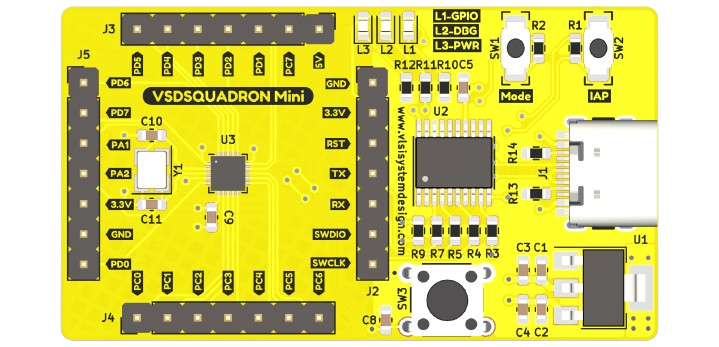
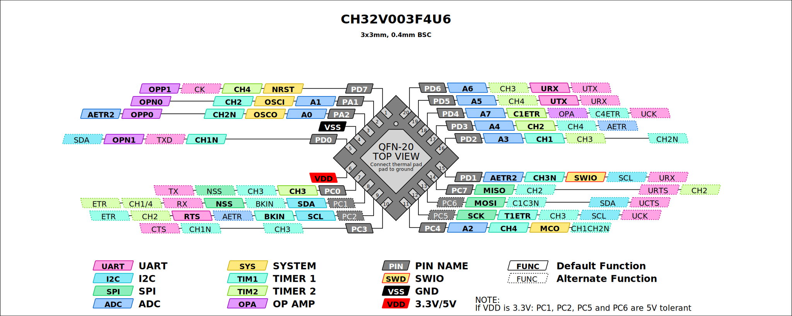
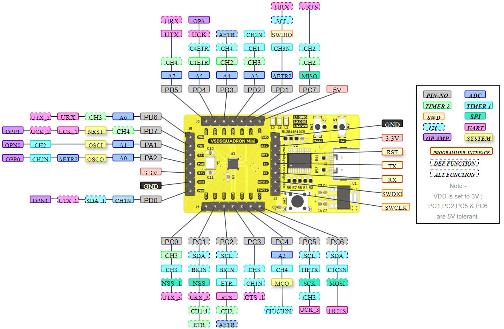

# VSDSQUADRONMini

[](https://github.com/vsdip/vsdsquadron_pio/actions)



Introducing the VSDSquadron Mini, a versatile powerhouse within the RISC-V landscape that elevates your development to new heights. Whether you’re a newcomer delving into the realm of embedded systems or an experienced developer crafting intricate devices, the VSDSquadron Mini is your ideal companion. It seamlessly bridges the gap between theory and practical application, offering an onboard flash programmer with a single-wire programming protocol to jumpstart your projects in education and development with proficiency and ease.

Product link: [VSDSQUADRONMini](https://www.vlsisystemdesign.com/vsdsquadronmini/)

Find the steps to get started [here!](https://github.com/vsdip/vsdsquadron_pio/blob/main/install.md)

## Reference documents

Functionality reference


Pinout diagram reference


Schematics [link](docs/VSDSquadronMini_2A_Schematic.pdf)

## Acknowledgemnets

This work is a modification of the projects available at [https://github.com/Community-PIO-CH32V/platform-ch32v](https://github.com/Community-PIO-CH32V/platform-ch32v). The VSD team expresses sincere gratitude to the open-source community for their valuable contributions.

We are enthusiastic about contributing to and advancing the development of open-source tools and fostering a collaborative community. Your support and involvement are essential to the success of this project.

Thank you for being part of our journey!

- The VSD Team

## List of VSDSquadronMini Projects

Welcome to our vibrant community, where new projects are continually emerging. Below, you'll find a list of innovative projects created using the powerful RISC-V development board.

Want to showcase your project? Just follow the steps below to get featured!

## Adding a Project

To add a new project, follow these steps:

1. **Create a Branch**  
   Start by creating a new branch for your changes.

2. **Add Entry to `./projects.csv`**  
   Append your project details to the `projects.csv` file. Ensure your entry adheres to the formatting and content guidelines.

3. **Run the Update Script**  
   Run the following command to update the README:
   ```sh
   $ python ./generate.py
   ```

4. **Submit a Pull Request**  
   Once your changes are ready, submit a pull request with a clear description of the additions.

### Submission Guidelines

- **Description**  
  Provide a short, single-sentence description of the project.

- **Public Link Confirmation**  
  Include a public link confirming the project's existence or details.

- **Character Limit**  
  Ensure that the display width does not exceed 80 characters.

- **README Editing**  
  **Do NOT edit the README directly.** The README is auto-generated based on the contents of the `projects.csv` file and other template files. All changes should be made to the appropriate source files, and then the README should be regenerated using the provided scripts.

### Example Entry

```
Example Project,Jane Doe,https://example.com,An example project demonstrating best practices.
```

Make sure all fields are correctly filled out, with proper Markdown syntax for the links. The generated README will reflect these changes, ensuring consistency and accuracy across the documentation.

--- 


| Project Title     | Author   | Description                    |
|-------------------|----------|--------------------------------|
| [RISC-V Mini Game Console](https://github.com/tejasopp/VSD_mini_ResearchInternship) | Tejas Anil Chaudhari | The Handheld Gaming Console project integrates a RISC-V microcontroller to create a portable gaming system featuring an OLED display and tactile buttons. This console allows users to play classic games like Snake and Pong with the RISC-V microcontroller managing game logic user input and rendering graphics. Additionally a sound module provides audio feedback to enhance the gaming experience. This project demonstrates the innovative use of RISC-V technology in creating an immersive and interactive gaming solution. |
