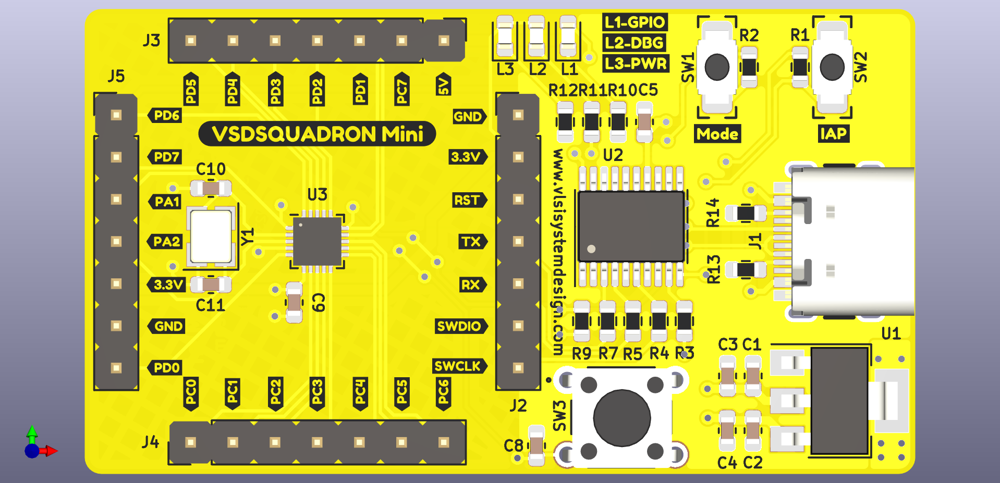

# VSDSQUADRON Platform IO\

Introducing the VSDSquadron Mini, a versatile powerhouse within the RISC-V landscape that elevates your development to new heights. Whether you’re a newcomer delving into the realm of embedded systems or an experienced developer crafting intricate device, the VSDSquadron Mini is your ideal companion. It seamlessly bridges the gap between theory and practical application, offering an on-board flash programmer with single-wire programming protocol to jumpstart your projects in education and development with proficiency and ease.

Purchace link: [VSDSQUADRONMini](https://www.vlsisystemdesign.com/vsdsquadronmini/)

Find the steps to get started [here!](https://github.com/vsdip/vsdsquadron_pio/blob/main/install.md)

## Acknowledgemnets

This work is a modification of the projects available at [https://github.com/Community-PIO-CH32V/platform-ch32v](https://github.com/Community-PIO-CH32V/platform-ch32v). The VSD team expresses sincere gratitude to the open-source community for their valuable contributions.

We are enthusiastic about contributing to and advancing the development of open-source tools and fostering a collaborative community. Your support and involvement are essential to the success of this project.

Thank you for being part of our journey!

- The VSD Team
