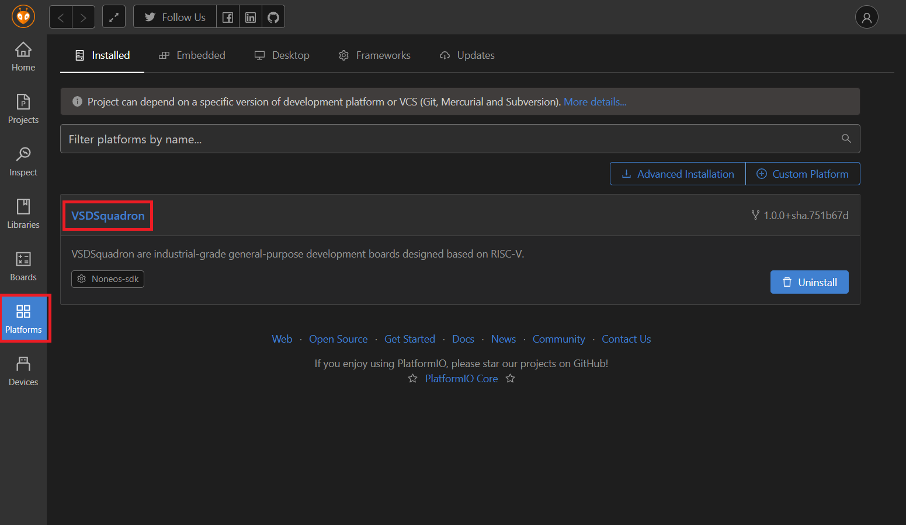

# VSDSquadron Development Environment Installation Guide

## Install VSCode

Download and install VSCode from [https://code.visualstudio.com/](https://code.visualstudio.com/).

## Install PlatformIO

1. Open the "Extensions" sidebar in VSCode.
2. Search for "PlatformIO" and click "install".

## Install CH32V Platform

1. Expand the PlatformIO sidebar (ant icon) and click "PIO Home".

2.In the PIO Home window, click on the "Platforms" sidebar and choose “Advanced Installation”.

3.Enter the following repository URL when prompted and press "Install".

> [https://github.com/vsdip/vsdsquadron_pio.git](https://github.com/vsdip/vsdsquadron_pio.git)

The VSDSQUADRON platform should now be successfully installed.

## Installing  Drivers

### Windows Driver Installation

Flashing development boards via a WCH-Link(E) probe (and SWCLK and/or SWDIO connection) requires that W.CH's USB drivers for that are installed.

1. Download the [WCHLink Driver Windows](https://github.com/Community-PIO-CH32V/wchlink-driver-windows/archive/refs/heads/main.zip) package
2. Unpack it
3. Run:`WCHLink\\SETUP.EXE` and follow the installation instructions
4. Run:`WCHLinkSER\\SETUP.EXE` and follow the installation instructions

If successful, once you plug in the WCH-Link(E) device, you should have a "serial port" and "interface"-type device in the Windows device manager.

## Understanding Platform IO Development Environment

WIP

## Uploading blink example

- Click on platforms
- click on vsdsquadron

- click on Examples
- click on Import

- Under vsdsquadronMini
- click build
- click upload

## For Ubuntu OS:
Make sure you have the Udev rules file. It can be found at /etc/udev/rules.d/99-platformio-udev.rules.
If not don't worry you can obtain it from internet:
Open terminal in any location:
type  or paste 
curl -fsSL https://raw.githubusercontent.com/platformio/platformio-core/develop/platformio/assets/system/99-platformio-udev.rules | sudo tee /etc/udev/rules.d/99-platformio-udev.rules

then insert this command in terminal to open that file:
sudo -i nano /etc/udev/rules.d/99-platformio-udev.rules

now append just below the end of file:
SUBSYSTEM=="usb", ATTR{idVendor}="1a86", ATTR{idProduct}=="8010", GROUP="plugdev"
SUBSYSTEM=="usb", ATTR{idVendor}="4348", ATTR{idProduct}=="55e0", GROUP="plugdev"
SUBSYSTEM=="usb", ATTR{idVendor}="1a86", ATTR{idProduct}=="8012", GROUP="plugdev"

press Ctrl+O to save the file.

Now open VSCode and click platform PIO
disconect and reconnect mini board.

Go to project explorer section inside vscode 
go to main.c and change delay_ms values 

Finally click Build and upload.
Yes it works!!!

Try with different delays.
