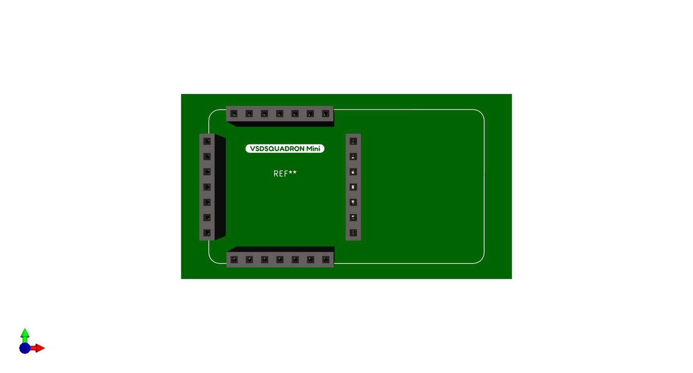
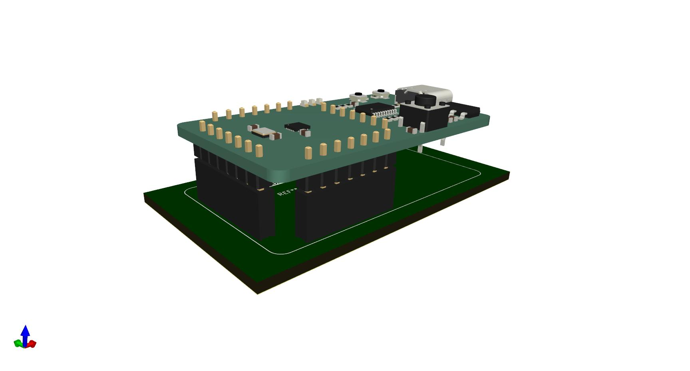

# Kicad Libraries for VSDsquadron Mini

Below are the KiCAD symbol, footprint and 3Dmodels for making a custom PCB.

Please note with this symbol you will be required to turn the male headers on the board upside down. See image below for reference.

## Reference Images

